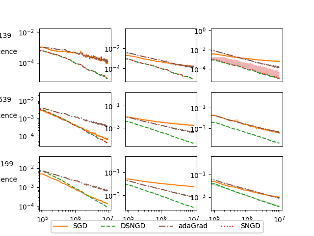

# Natural gradient based DSNGD in large dimension manifold 

This project implements a model for the classification problem
where a variable Y
is desired to be predicted after a variable X, by optimizing the 
log likelihhood function or the conditional Kullback-Leibler divergence. 
Implementation of optimization algorithm dsngd added as well as 
sgd, adagrad and sngd (adding more algorithms in the future).
The code found in this project is used to create the graphs appearing in my Ph.D Thesis with title: _Efficient 
and convergent natural gradient based optimization 
algorithms for machine learning_ and the research paper named _Dual Stockastic Natural Gradient Descent_.
### Running the default experiment
Clone the project and access the directory. Install packages appearing in requirements.txt. Finally,
execute _experiment.py_ coding file:
```bash
python3 bin/experiment.py
```
### Set up a new experiment
For a custom experiment with different settings open the _experiemnt.py_ file
and fill the variables with the desired values. Modifiable variables are:

```python
## Manifold related variables
y_values = 10  # Classes of discrete variable Y
xd_values = [7,6,7,2,7]  # Values of discrete variables  x_i in X assuming Naive Bayes
xg_values = 0  # Amount of x_i gaussian variables in X assuming Naive Bayes

## Algorithm related variables
algs = [sgd,  adagrad, dsngd, sngd] # A list of the algorithms to test
batch = 250  # Batch of sample fed to algorithm per iteration

## Sample related variables
sample_length = 100000  # Length of the sample
epochs = 1  # Repetitions of the sample
```


