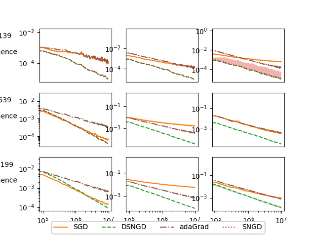

# Natural gradient based DSNGD in large dimension manifold 

This project implements a model for the classification problem
where a variable Y
is desired to be predicted after a variable X, by optimizing the 
log likelihhood function or the conditional Kullback-Leibler divergence. 
Implementation of optimization algorithm dsngd added as well as 
sgd, adagrad and sngd (adding more algorithms in the future).
The code found in this project is used to create the graphs appearing in my Ph.D Thesis with title: _Efficient 
and convergent natural gradient based optimization 
algorithms for machine learning_ and the research paper named _Dual Stockastic Natural Gradient Descent_.
### Running the default experiment
Clone the project and access the directory. Install packages appearing in requirements.txt. Finally,
execute _experiment.py_ coding file:
```bash
python3 bin/experiment.py
```
### Set up a new experiment
For a custom experiment with different settings open the _experiemnt.py_ file
and fill the variables with the desired values. Modifiable variables are:

```python
## Manifold related variables
y_values = 10  # Classes of discrete variable Y
xd_values = [7,6,7,2,7]  # Values of discrete variables  x_i in X assuming Naive Bayes
xg_values = 0  # Amount of x_i gaussian variables in X assuming Naive Bayes

## Algorithm related variables
algs = [sgd,  adagrad, dsngd, sngd] # A list of the algorithms to test
batch = 250  # Batch of sample fed to algorithm per iteration

## Sample related variables
sample_length = 100000  # Length of the sample
epochs = 1  # Repetitions of the sample
```



### Continuous and mixed exponential-family features

The `continuous_dsngd` branch adds a generic Naive Bayes exponential-family path
alongside the original discrete `JointMLR` implementation. The new path is built
around one abstraction per feature coordinate:

- `src.families.CategoricalCoordinate`
- `src.families.GaussianKnownVarianceCoordinate`
- `src.families.GaussianUnknownVarianceCoordinate`
- `src.families.MultivariateGaussianCoordinate`
- `src.families.PoissonCoordinate`
- `src.families.ExponentialMeanCoordinate`

These families implement the expectation-coordinate score
`grad_theta_star log f(x; theta_star)`, which is the only family-specific term
needed by the generic DSNGD direction under the Naive Bayes assumption.

Core pieces:

- `src.model.NaiveBayesEF`: generic model for heterogeneous feature coordinates.
- `src.algorithms.dsngd_ef.DSNGD_NaiveBayesEF`: generic DSNGD direction/update.
- `src.algorithms.sgd_ef.SGD_NaiveBayesEF`: generic SGD baseline for the same models.
- `src.algorithms.adagrad_ef.AdaGrad_NaiveBayesEF`: AdaGrad baseline using the
  same EF gradient as SGD with adaptive per-coordinate steps.
- `src.data.ef_sample_creator.NaiveBayesEFSampleIterator`: synthetic sampler for
  categorical, continuous, and mixed feature vectors.

Run the smoke tests with:

```bash
python -m unittest discover -s tests
```

Run a small mixed categorical/Gaussian comparison between generic SGD and DSNGD
with:

```bash
python bin/experiment_ef_small.py
```

The script writes evaluation-loss plots and CSV summaries to
`outputs/ef_small_comparison/`.

Run the 3x3 exponential-family grids with:

```bash
python bin/experiment_ef_family.py gaussian
python bin/experiment_ef_mixed.py
python bin/experiment_ef_mixed_repeated.py
```

Synthetic grid experiments use a matched sampler by default: the true
data-generating model is drawn in the same exponential-family product manifold
as the model being fitted. The CSV outputs include the sampler regime so future
misspecified experiments can be compared explicitly.

Prepare and run a first real-data MNIST experiment with:

```bash
python bin/experiment_ef_mnist.py --feature-family gaussian
```

The script downloads MNIST into `saved_data/mnist/` when needed. Current
per-pixel feature-family choices are `gaussian`, `binary-categorical`, and
`poisson`; this keeps the real-data experiment ready for richer families such as
a multivariate Gaussian later. MNIST training runs for 10 epochs by default; use
`--epochs 100` for a longer run.

Experiment definitions live in `src/experiments/ef_specs.py`; the shared runner,
learning-rate search, independent evaluation split, CSV output, and plotting live
in `src/experiments/ef_grid.py`.
